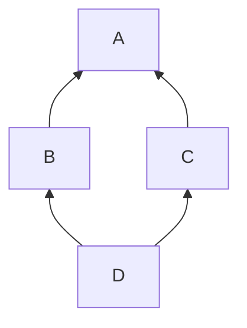

> 基础直接跳过，从P84开始看，也就是面向对象部分：[01 程序的内存模型-内存四区-代码区._哔哩哔哩_bilibili](https://www.bilibili.com/video/BV1et411b73Z?p=84&vd_source=8e66d0be2e227fad85c74192f79799d6) 

# 面向对象编程

## new/delete

内存分区模型

* 代码区：存放函数体的二进制代码，由OS管理
* 全局区：存放全局变量、静态变量、常量。在程序结束后由OS释放
* 栈区：编译器自动分配释放，存放函数的参数值、局部变量等
* 堆区：程序员分配释放，程序结束OS也会自动回收

堆区数据：new → 堆区

```c++
int main() {
    int* a = new int(10); // new关键字创建的数据在堆区
    cout << a << ":" << *a << endl; // 0x197997018e0:10
    return 0;
}
```

new返回的是该数据类型的一个指针

```c++
int* b = new int[10]; // new数组
for (int i = 0; i < 10; ++i) {
    b[i] = i + 100;
    cout << "b[" << i << "]:" <<b[i] << endl;
}
```

释放用 delete，delete后再读取该块内存会引发异常。

```
delet a;
delete[] b;
```

## 引用

格式

```c++
int &b = a; //int* const b = &a;
```

注意

* <u>引用必须要初始化，且初始化后不可再更改。</u>`b=c` 是赋值，不是更改引用
* 在函数调用中用引用，可以改变原参数的值。引用本质就是指针
* 不能返回局部变量的引用，很可能返回不出来正确值（如果能打印出来可能是因为编译器自动保留,这种情况一般第二次就打不出来了。也可能直接就没内容）

```c++
void change1(int &a){ //要是想防止修改就用 const int &a
    a=20; //可以改变a的值
}
int main() {
    int a = 0;
    change(a);
    cout << a << endl; //a=20
    return 0;
}
```

常量引用需要加 const关键字

```c++
const int& ref = 10; // int temp = 10; const int& ref = temp;
```

## 函数

默认值：函数缺省就用默认值，传了参数就用传的值。规定默认值后的所有参数都要给默认值。<u>函数声明和实现中只能有一个设置默认参数。</u>

占位参数：`int fun2(int a,int){...}` 

函数重载：重载条件是函数名相同，但参数个数/顺序/类型不同。返回值不同不能作为重载条件

## 类和对象

### 封装

<u>封装、继承、多态</u>

一个最简单的类以及调用

```c++
class Circle{
public://访问权限
    //属性
    float r;
    //行为
    float getCircle(){
        return 2 * 3.14 * r;
    }
};

int main(){
    cout << "sample.cpp" << endl;
    Circle circle;
    circle.r = 10.0;
    cout << "circumference: " << circle.getCircle() << endl;
    return 0;
}
```

其中有三种访问权限

* public-公有
* protected-保护：类内成员可以访问，类外不行；继承中子可以访问父
* private-私有：类内可以类外不行；继承中子不可以访问父

struct＆class

* struct 默认权限 public
* class 默认权限 private

一般将成员属性设置为私有：将属性设置为私有，另外设置一些 public 方法进行读/写操作

### 构造函数&析构函数

#### 构造函数

构造函数： `类名(){}`

* 可以有参数，因此可以重载
* 没有返回值也不写void
* 调用对象时自动调用构造，不用手动调用，且只会调用一次。即初始化时就调用

析构函数： `~类名(){}`

* 没返回值也不写void
* 不可以有参数，也不可以重载
* 对象销毁前自动调用析构，不用手动调用，且只会调用一次

调用规则：编译器默认提供三个函数。自定义有参构造函数后，不再提供默认无参构造；自定义拷贝构造后，不再提供默认的其他构造函数

* 默认构造：空实现
* 析构函数：空实现
* 拷贝构造：值拷贝

```C++
class Person{
public:
    Person(){
        cout << "Person()" << endl;
    }
    ~Person(){
        cout << "~Person()" << endl;
    }
};

int main() {
    Person p; //Person()和~Person()都输出
    return 0;
}
```

> 都调用的原因是，p是栈上数据，自动释放后会调用析构

分类

* 有参/无参构造
* 普通/拷贝构造

构造函数

```c++
class Person{
public:
    int age;
    //无参构造
    Person(){ 
        cout << "Person()" << endl;
    }
    //有参构造
    Person(int a){ 
        cout << a << endl;
    }
    //拷贝构造
    Person(const Person &p){ 
        age = p.age;
    }
};

int main() {
    Person p;
    p.age = 10;
    Person p1(p); //Person p1 = Person(p)
    cout << "p1.age:" << p1.age << endl;
    return 0;
}
```

构造函数调用

* 括号：

  ```C++
  Person p; //Person p()不行,不能创建对象,会被认为是一个函数声明
  Person p1(10);
  //Person p2(p1)不行,会等价于Person p2
  ```

  <u>针对调用默认构造时不能加括号；不要用拷贝构造函数初始化匿名对象</u> 

* 显示：

  ```C++
  Person p;
  Person p1 = Person(10); //有参构造
  Person p2 = Person(p2); //拷贝构造
  ```

* 隐式转换：

  ```C++
  Person p4 = 10; //Person p4 = Person(10)
  Person p5 = p4;
  ```

匿名对象：当前行结束就销毁（执行析构）。

#### 初始化列表

传统的初始化，声明变量后通过构造函数传入参数、赋值可以进行初始化

```C++
class Test{
public:
	int m_a;
	int m_b;
	int m_c;

	//传统方式
    Test(int a, int b, int c){
		m_a = a;
		m_b = b;
		m_c = c;
	}

	//初始化列表
    Test(int a, int b, int c):m_a(a),m_b(b),m_c(c){
	}
};
```

#### 拷贝构造函数

拷贝构造函数调用

* 使用一个已经创建完的对象来初始化一个新对象

  ```C++
  Person p1(10);
  Person p2(p1);
  ```

* 值传递的方式给函数参数传值

  ```C++
  void test_person(Person p){
  	cout << "test_person()" << endl;
  }
  int main()
  {
  	Person p;
  	test_person(p); //值传递,这里拷贝了
  	return 0;
  }
  ```

* ~~以值的方式返回局部对象~~：已经被优化了

  ```C++
  Person test2(){
  	Person p1(5);
  	cout << (int*)&p1 << endl;
  	return p1;
  }
  
  int main()
  {
  	Person p = test2();
  	cout << (int*)&p << endl;
  	return 0;
  }
  ```

  > ~~这里存疑，视频里说是值传递，本地运行出来是整个对象传递~~
  >
  > 已解决，[C++ 函数返回对象时并没有调用拷贝构造函数_shang_ch的博客-CSDN博客](https://blog.csdn.net/nbu_dahe/article/details/119142610) 中有解释：其原因是 RVO（return value optimization），被G++进行值返回的优化了，可以对g++增加选项 `-fno-elide-constructors` 将RVO优化关闭

#### 深拷贝&浅拷贝

浅拷贝：简单的赋值拷贝；编译器提供的拷贝构造函数就是钱拷贝

深拷贝：在堆区重新申请空间进行拷贝操作

浅拷贝：

```C++
class Person
{
public:
	int age=18;
	int* n;

	Person(int a, int number)
	{
		cout << "Person(int a)" << endl;
		age = a;
		n = new int(number); //开到堆区
	}
};

int main()
{
	Person p1(19,2);
	Person p2(p1);
	p1.age = 20;
	*p1.n = 3;
	cout << "p1.age:" << p1.age << "; p1.n:" << *p1.n << endl; //p1.age:20; p1.n:3
	cout << "p2.age:" << p2.age << "; p2.n:" << *p2.n << endl; //p2.age:19; p2.n:3
	return 0;
}
```

* 这里面 age、n 属性都进行浅拷贝，p2.n 会随着 p1.n 改变，查地址可以看到这两个 n 是一个地址

> 有创建堆区，就要记得用析构释放堆区，但是浅拷贝释放堆区空间时会出现问题

```C++
~Person()
{
    if (n != NULL){
        delete n;
        n = NULL; //防止野指针出现,做置空
    }
    cout << "~Person" << endl;
}
```

* p2 释放一次 n 的堆区，p1 再释放一次就重复了 → 深拷贝解决

深拷贝：这样 p1 的修改就不会影响 p2 的值（指针保存的内容）

```C++
Person(const Person &p)
{
    cout << "Person(const Person &p)" << endl;
    age = p.age; //浅拷贝
    n = new int (*p.n); //深拷贝
}
int main()
{
	Person p1(19,2);
	Person p2(p1);
	p1.age = 20;
	*p1.n = 3;
	cout << "p1.age:" << p1.age << "; p1.n:" << *p1.n << endl; //p1.age:20; p1.n:3      
	cout << "p2.age:" << p2.age << "; p2.n:" << *p2.n << endl; //p2.age:19; p2.n:2 
	return 0;
}
```

也就是，<u>如果有开辟堆区数据，就要自己写拷贝函数实现深拷贝，防止出问题</u>

### 成员变量/函数

#### 对象成员

C++ 中允许类的成员是另一个类对象，即对象成员

```C++
class A {}
class B {
    A a;
}
```

```C++
class Test{
public:
	int m_a;
	Person m_p;
	Test(int a, Person p): m_a(a), m_p(p) {
	}
};

int main()
{
	Person p(18,1);
	Test t(5,p);
	cout << "m_a:" << t.m_a << endl;
	cout << "m_p.age:" << t.m_p.age << endl;
	cout << "m_p.n:" << *t.m_p.n << endl;
	return 0;
}
```

* 构造函数中会先创建 Person 再创建 Test，析构函数顺序相反

#### static

静态成员变量

* 所有对象共享一份数据。可以更改，只是一改就全改了

  ```C++
  Person p1;
  Person p2;
  p2.a = 20;
  cout << p1.a << endl; //p1.a = p2.a都被改了
  ```

* 编译阶段分配内存

* 类内声明，类外初始化

  ```C++
  class Person{
  public:
  	static int a;
  };
  int Person::a = 10; //int a就成全局变量了,用::限制作用域
  ```

静态成员变量还可以通过类名访问： `cout << Person::a << endl;` ，当然如果是 private 就访问不到了

静态成员函数

* 所有对象共享一个函数
* 静态成员函数只能访问静态成员变量

静态成员函数也可以通过对象、类名访问

```C++
class Person{
public:
	static void func(){
	cout << "static void func()" << endl;
	}
};

int main()
{
	Person p1;
	p1.func();
	Person::func();
	return 0;
}
```

存储

* 空对象占用1内存，是为区分对象占内存的位置。只要不空了，不会平白无故占字节的

* 静态成员变量不计入上面的 sizeof 计算内存，他不属于类的对象上

* 成员函数和成员变量分开存储的，所以也没算进去，不属于类的对象上

  ```C++
  class Person{ //空时为1
      int a; //4
      static int b; //0
      void func(){} //0
      static void func1(){} //0
  };
  ```

#### this

c++ 提供的一个特殊的对象指针 this 指针，this 指针指向被调用的成员函数所属的对象，它隐含在每个非静态成员函数内，不用自己定义

用途

* 形参与成员变量重名时用 this 区分

  ```C++
  class Person{
  public:
      int a;
      Person(int a){
          this -> a = a;
      };
  };
  int main(){
      Person p(1);
      cout << p.a << endl;
      return 0;
  }
  ```

* 类的非静态成员函数中返回对象本身可以用 `return *this` 

  ```C++
  class Person{
  public:
      int a;
      Person(int a){
          this->a = a;
      };
      Person& addSelf(Person &p){
          this -> a += p.a;
          return *this;
      }
  };
  
  int main(){
      Person p1(10);
      Person p2(1);
      p2.addSelf(p1).addSelf(p1).addSelf(p1); //这样返回就是对象,可以累积使用,即链式编程
      cout << p2.a << endl;
      cout << "end" << endl;
      return 0;
  }
  ```

  如果返回不是 `Person&` 而是 `Person`，则只加了一次10，因为返回时调用了拷贝构造函数而不是p2本体了

  ```C++
  //返回是Person不是Person&时
  cout << p2.addSelf(p1).addSelf(p1).a << endl; //p2+p1+p1
  p2.addSelf(p1).addSelf(p1).addSelf(p1);
  cout << p2.a << endl; //p2+p1,后面加的两次没用
  ```

空指针也可以访问成员函数

```C++
int main()
{
	Person * p = NULL;
	p -> func();
	return 0;
}
```

#### const

常函数

* 不可修改成员属性

* 成员属性声明时加关键字 mutable 后，常函数中依旧可以修改

  ```C++
  class Person{
  public:
  	int m_a;
  	mutable int m_b;
  	void func1() const{ //这个const限制的其实是this
  		// this->m_a = 1;报错
  		this->m_b = 2;
  	}
      void func2(){}
  };
  ```

常对象

* 只能调用常函数，因为普通的成员函数可以修改属性

  ```C++
  const Person p;
  p.m_a = 1; //不可以
  p.m_b = 2; //可以
  p.func1(); //可以
  p.func2(); //不可以
  ```

### 友元

一些私有属性想让类外的函数等访问需要利用友元

实现

* 全局函数做友元

  ```C++
  void test1();
  
  class Test1{
  public:
      friend void test1();
  private:
      int m_b;
  };
  
  void test1(){
      Test1 t;
      t.m_b = 1;
  }
  ```

* 类做友元

  ```C++
  class Test1{
  public:
      friend class Test2;
      int m_a;
  private:
      int m_b;
  };
  
  class Test2{
  public:
      void test(){
          Test1 t;
          t.m_b = 1; //前面加上friend那行就访问成功了
      }
  };
  ```

* 成员函数做友元

  ```C++
  class Test2{
  public:
      void test();
  };
  
  class Test1{
  public:
      friend void Test2::test();
      int m_a;
  private:
      int m_b;
  };
  
  void Test2::test(){
      Test1 t;
      t.m_b = 1;
  }
  ```

可以类外写函数 `类名::函数名` ，在类外实现

```C++
Test1::test1(){
    ...
}
```

### 运算符重载

加法：`+`

* 可以通过成员函数，也可以通过全局函数

    ```C++
    class Test1{
    public:
        int m_a;
        //通过成员函数
        //使用引用类型调用可以避免拷贝,节省空间时间,直接传对象也能实现
        Test1 operator+(const Test1 &t){ //Test1 operator+(Test1 t)
            Test1 temp;
            temp.m_a = this->m_a + t.m_a;
            return temp;
        }
    };

    //通过全局函数
    Test1 operator+(Test1 &t1, Test1 &t2) {
        Test1 temp;
        temp.m_a = t1.m_a + t2.m_a;
        return temp;
    }

    int main(){
        Test1 t1;
        t1.m_a = 1;
        Test1 t2;
        t2.m_a = 11;
        Test1 t3 = t1 + t2;
        cout << t3.m_a << endl;
        return 0;
    }
    ```

* 重载仅限于自定义数据类型，比如类相加，对于内置的数据类型比如 int 相加这种不能修改

左移：`<<`

* 通常不用成员函数重载 <<

  ```C++
  Test1 operator<<(cout) //p.operator(cout)简化是p << cout,但是要cout << p无法实现
  ```

* 只能用全局函数

  ```C++
  ostream& operator<<(ostream &cout, Test1 &t){ //cout是输出流对象,且是全局的只能通过引用调用
      cout << t.m_a ;
      return cout;
  } //cout可以改名,引用就是起别名,起啥都行
  
  int main(){
      Test1 t1;
      t1.m_a = 1;
      cout << t1 << endl; //如果函数返回是void就不能继续链式引用加endl换行了
      cout << "end" << endl;
      return 0;
  }
  ```

综合使用，通常设置成 private 属性，设置全局函数友元实现操作，赋值可以通过 publi c方法

递增：`++`

```C++
class TestInt{
public:
    TestInt(){
        m_n = 0;
    }
    // 前置
    // 返回引用是为了一直对一个对象进行操作,++(++t)这样就是加两次,不用引用第二次累加就成对新对象的操作
    TestInt& operator++(){
        m_n++;
        return *this;
    }
    // 后置
    TestInt& operator++(int){ // int做占位参数用于区分重定义的函数
        TestInt temp = *this;
        m_n++;
        return temp;
    }
    int m_n;
};

int main(){
    TestInt t;
    ++(++t);
    t++;
    return 0;
}
```

递减同理，加号变成减号即可

赋值运算符：

* 注意深浅拷贝影响到的，释放堆区内存时重复的问题

  ```C++
  class Person{
  public:
      Person(int age){
          m_age = new int(age); // 开到堆区
      }
      Person& operator=(Person &p){
          //编译器默认提供的是浅拷贝m_age=p.m_age;
          //先判断是否在堆区有属性,有就先释放后进行深拷贝
          if(m_age != NULL){
              delete m_age;
              m_age = NULL;
          }
          m_age = new int(*p.m_age);
          return *this;
      }
      int *m_age;
  };
  
  int main(){
      Person p1(18);
      Person p2(20);
      p2 = p1;
      cout << p1.m_age << ":" << *p1.m_age << endl;
      cout << p2.m_age << ":" << *p2.m_age << endl;
      return 0;
  }
  ```

关系运算符重载：`==` 和 `!=` 同理

```C++
bool operator==(Person p){
    if (this->m_age == p.m_age)
        return true;
    else
        return false;
}
```

函数调用运算重载：

* 由于使用起来很像函数，也叫仿函数；很灵活没有固定写法

  ```C++
  class TestPrint{
  public:
      void operator()(string test){
          cout << test << endl;
      }
  };
  
  int main(){
      TestPrint t;
      t("hello");
      return 0;
  }
  ```

* 匿名函数对象 `TestPrint()("hello");`

### 继承

#### 单继承

子类也叫派生类，父类也叫基类。继承能减少重复代码

继承方式

* 公共继承：`class 子类:public 父类 {};` 

  ```C++
  class A{
  public:
      int a;
  private:
      int b;
  protected:
      int c;
  };
  
  class B: public A{
  public:
      int a;
  protected:
      int b;
  private:
      //不可访问int c;
  };
  ```

* 保护继承

  ```C++
  class C: protected A{
  protected:
      int a;
      int b;
  private:
      //不可访问int c;
  };
  ```

* 私有继承

  ```C++
  class D: private A{
  private:
      int a;
      int b;
      //不可访问int c;
  };
  ```

  简单讲就是子类可以缩小权限不可以扩大；虽然 private 权限不能访问，但是继承下来，有占空间

构造和析构函数顺序：父类构造→子类构造→子类析构→子类构造

父类子类中的同名成员访问：属性和函数同理

* 可直接访问子类中的

* 访问父类中的要加作用域

  ```C++
  s.m_age; //子类
  s.Person::m_age; //父类
  ```

* <u>如果子类与父类有同名函数，则子类的同名函数会隐藏掉父类中所有的同名函数，所以哪怕父类有多个同名函数（发生函数重载），子类也没办法直接调用（比如参数不一样的同名的父与子类的函数），要依靠作用域</u>

静态成员的继承和非静态的一致

#### 多继承

```C++
class Base1{
public:
    Base1(int a): m_a(a) {}
    int m_a;
};

class Base2{
public:
    Base2(int b): m_b(b) {}
    int m_b;
};

class Test: public Base1, public Base2{
	... ...
};
```

父类中出现同名时，要标明作用域

#### 菱形继承



D对象访问A中声明的成员时会发生二义性，不知道从B还是C中获取，因此要作用域才能区分。但是这样有两份作用域，只需要一份数据

解决：虚继承 virtual

```C++
class Base{
public:
    int m_Base;
};

class Base1: virtual public Base {};

class Base2: virtual public Base {};

class Test: public Base1, public Base2 {};

int main(){
    Test t;
    t.m_Base = 9;
    cout << t.m_Base << endl;
    return 0;
}
```

### 多态

#### 简单使用

多态

* 静态多态：函数重载、运算符重载，复用函数名
* 动态多态：派生类和虚函数实现运行时多态
* 区别：静态多态的函数地址早绑定，编译阶段确定函数地址；动态的晚绑定，运行时确定

类型转换：允许类型转换

地址早绑定

```C++
class Animal{
public:
    void speak(){
        cout << "spaek()" << endl;
    }
};

class Cat: public Animal{
public:
    void speak(){
        cout << "cat:spaek()" << endl;
    }
};

void test(Animal& a){
    a.speak();
}

int main(){
    Cat c;
    test(c);
    return 0;
}
```

通过虚函数实现晚绑定

```C++
class Animal{
public:
    virtual void speak(){... ...} //这样执行test(c)就是Cat.speak()在执行
};

class Cat: public Animal{... ...};

void test(Animal& a){
    a.speak();
}
```

根据传入对象的不同执行不同地址的函数

动态多态条件

* 有继承关系
* 子类重写（不是重载）父类的虚函数。比如父类函数无法满足子类要求时需要在子类中重写
* 使用：父类指针指向子类对象

#### 原理

`sizeof(Animal)` 为8：是一个指针的大小，虚函数本质就是指针

有一个虚函数指针 vfptr 指向虚函数表 vftable，vftable 中有记录虚函数的地址

如果没发生重写，子类继承这个指针以及虚函数表。发生重写后，会对其虚函数表进行覆盖，替换成该子类的虚函数地址。当父类指针或者引用指向子类时，就发生了多态

#### 纯虚函数和抽象类

多态中父类中的虚函数通常没用意义，一般调用子类重写的内容，因此把虚函数称为纯虚函数，纯虚函数就不用写实现了。当类中有了纯虚函数，该类称为抽象类

```C++
class Animal{
public:
    virtual void speak() = 0;
};
```

抽象类

* 无法实列化对象：`Animal a` 会报错
* 抽象类的子类必须重写父类中的纯虚函数

#### 虚析构和纯虚析构

多态中有个问题，子类中有堆区数据的话，父类指针在释放时无法调用子类的析构代码，需要虚析构/纯虚析构。

虚析构与纯虚析构

* 需要有具体的函数实现
* 纯虚析构则该类是抽象类，无法实例化对象

父类指针析构时不会调用子类的析构函数，导致如果子类有堆区数据会有内存泄露→改成虚析构

```C++
class Animal{
public:
    Animal(){
        cout << "Animal()" << endl;
    }
    virtual ~Animal(){ //虚析构,不加virtual会导致不执行Animal的析构函数
        cout << "~Animal()" << endl;
    }
    virtual void speak() = 0;
};

class Cat: public Animal{
public:
    Cat(string name){
        cout << "Cat()" << endl;
        m_name = new string(name); //堆区数据
    }
    virtual void speak(){
        cout << *m_name <<":cat:spaek()" << endl;
    }
    ~Cat(){ //释放堆区
        if(m_name != NULL){
            cout << "~Cat()" << endl;
            delete m_name;
            m_name = NULL;
        }
    }
    string *m_name;
};

int main(){
    Animal* a = new Cat("Tom");
    a->speak(); //执行Cat::~spaek()
    delete a;
    return 0;
}
```

纯虚析构：

* 纯虚析构要在类外实现，需要声明也需要实现
* 与纯虚函数不一样，纯虚函数不需要类外实现
* 有纯虚析构也是抽象类，无法实例化对象

```C++
class Animal{
public:
    Animal(){
        cout << "Animal()" << endl;
    }
    virtual ~Animal() = 0;
    virtual void speak() = 0;
};

Animal::~Animal() {
    cout << "~Animal()" << endl;
}
```

## 文件操作

需要包含文件流 `#include <fstream>`

* 写 `ofstram` 
* 读 `ifstream` 
* 读写 `fstream` 

对文件操作有

* 文本文件：ASCII码存储
* 二进制文件：二进制存储

### 文本文件

写文件流程：

* 包含头文件

* 创建流对象 `ofstream ofs` 

* 打开文件 `ofs.open("路径",打开方式)` 

* 写数据 `ofs << "写入的内容"` 

* 关闭文件 `ofs.cloes()` 

  ```C++
  int main()
  {
  	ofstream ofs;
  	ofs.open("1.txt",ios::out); //相对路径,同级目录
  	ofs << "123456";
  	ofs.close();
  	return 0;
  }
  ```

打开方式：通过 `|` 可以同时用两种方式

| 打开方式    | 解释                     |
| ----------- | ------------------------ |
| ios::in     | 读文件                   |
| ios::out    | 写文件                   |
| ios::ate    | 初始位置：文件尾         |
| ios::app    | 追加方式写文件           |
| ios::trunc  | 如果文件存在先删除再创建 |
| ios::binary | 二进制方式               |

读文件流程

* 包含头文件

* 创建流对象 `ifstream ifs` 

* 打开文件判断文件是否打开成功 `ifs.open("路径",打开方式)` 、`ifs.is_open()`

* 读数据有四种方式读取

* 关闭文件 `ifs.cloes()` 

  ```C++
  int main()
  {
  	ifstream ifs;
  	ifs.open("2.txt",ios::in);
  	if (!ifs.is_open())
  	{
  		cout << "failed" << endl;
  		return 0;
  	}
  	
  	//方法1
  	char buf[100] = {0};
  	while (ifs >> buf)
  	{
  		cout << buf << endl; //endl去补被打断的换行
  	}
  
  	//方法2
  	while (ifs.getline(buf,sizeof(buf)))
  	{
  		cout << buf << endl;
  	}
  	
  	//方法3
  	string str;
  	while (getline(ifs,str)) //全局的getline函数
  	{
  		cout << str << endl;
  	}
  	
  	//方法4 不推荐
  	char c;
  	while ((c = ifs.get()) != EOF) //逐字符读,EOF文件尾
  	{
  		cout << c;
  	
  	ifs.close();
  	return 0;
  }
  ```

### 二进制文件

写二进制：利用流对象调用成员函数write `ostream& write(consat char * buffer, int len);`

```C++
class Person{
public:
	char m_name[64];
	int m_age;
};

int main()
{
	ofstream ofs;
	ofs.open("1.txt",ios::out | ios::binary);
	Person p = {"Alice", 18};
	ofs.write((const char*)&p,sizeof(Person));
	ofs.close();
	return 0;
}
```

读二进制：用read

```C++
int main()
{
	ifstream ifs;
	ifs.open("1.txt",ios::in | ios::binary);
	if (!ifs.is_open())
	{
		cout << "failed" << endl;
		return 0;
	}
	Person p;
	ifs.read((char *)&p, sizeof(Person)); //返回一个地址,用p接收还要强制类型转换成char*
	cout << p.m_name << "," << p.m_age << endl;
	ifs.close();
	return 0;
}
```

# 泛型编程和STL

## 模板

两种模板机制：函数模板、类模板

### 函数模板

模板提高代码的复用性

建立一个通用函数，返回值类型和形参类型可以补定义，用一个虚构的类型代表

```C++
template<typename T> //typename也可以用class
void tSwap(T &a, T &b){
	T tmp =a;
	a = b;
	b = tmp;
}
int main()
{
	int a = 1;
	int b = 2;
	tSwap(a, b); //1.自动类型推导
	tSwap<int>(a, b); //2.显示指定类型,int指定的是T类型
	cout << a << "," << b << endl;
	return 0;
}
```

两种使用方式

* 自动类型推导：必须推导出一致的数据类型T

* 显示指定类型

* 模板必须有确定出T的数据类型才能执行

  ```C++
  template<typename T> //typename也可以用class
  void func(){
  	cout << "func()" << endl;
  } //这样在调用func()时就会报错,可以显示指定func<int>()
  ```

> 不知道为什么，`template<typename T>` 这样写一个文件里不能出现两次，换成 `template<class T>` 就没事

普通函数与函数模板区别

* 普通函数可以发生自动类型转换（隐式类型转换）

  ```C++
  int testAdd(int a, int b){
  	return a+b;
  }
  ... ...
  cout << testAdd(10, 'a') << endl; //107
  ```

* 调用函数模板，如果用自动类型推到，则不发生隐式类型转换

  ```C++
  template<class T>
  T testAdd2(T a, T b){
  	return a+b;
  }
  ... ...
  cout << testAdd2(10, 'a') << endl; //报错
  ```

* 如果用显示指定类型，可以发生隐式类型转换

  ```C++
  cout << testAdd2<int>(10, 'a') << endl; //107
  ```

普通函数和函数模板之间可以发生重载

调用规则

* 如果普通函数和函数模板都可以实现，优先普通函数

  ```C++
  void myPrint(int a, int b){
  	cout << "void myPrint(int a, int b)" << endl;
  }
  template<class T>
  void myPrint(T a, T b){
  	cout << "template: void myPrint(T a, T b)" << endl;
  }
  ... ...
  myPrint(1,2); //执行普通函数
  ```

* 可通过空模板参数列表参数来强制调用函数模板

  ```C++
  myPrint<>(1,2); //执行模板函数
  ```

* 函数模板也可以重载

* 如果函数模板可以产生更好的匹配，则优先函数模板

  ```C++
  myPrint('a','b'); //执行模板函数
  ```

  虽然可以char转换成int使用普通函数，但是函数模板更合适

模板有局限性：比如 `T a` 这样传参如果传的是一个数组就没法处理了，传一个类也会有问题。因此模板为这些特定的数据类型提供具体化操作

```C++
template<class T>
int compare(T &a, T &b){
	return a==b;
}

int main()
{
	int a = 1;
	int b = 2;
	cout << compare(a, b) << endl; //可以运行

	Person p1 = Person("Alice",18);
	Person p2 = Person("Bob",20);
	cout << compare(p1, p2) << endl; //报错

	return 0;
}
```

比如做基本运算的一个模板函数，如果对类是无法操作的，一种解决办法是重载运算符号，一种是具体化操作

```C++
template<> int compare(Person &p1, Person &p2){ //用template表名这是重载的函数
	return (p1.m_name==p2.m_name) && (p1.m_age == p2.m_age);
} //compare(p1, p2)这样就不报错了
```

> 一般不自己写，用STL中的模板

### 类模板

```C++
template<class NameType, class AgeType>
class Person{
public:
	Person(NameType name, AgeType age): m_name(name), m_age(age) {}
	void showPerson(){
		cout << "name:" << m_name << endl;
		cout << "age:" << m_age << endl;
	}
	AgeType m_age;
	NameType m_name;
};

int main()
{ 
	Person<string,int> p1("alice",18);
	p1.showPerson();
	return 0;
}
```

类模板与函数模板

* 类模板没有自动类型推导的使用方式
* 类模板在模板参数列表中可以有默认参数


# 最后
