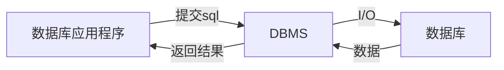

> 部分跟着课内记得笔记，部分看的 [菜鸟教程](https://www.runoob.com/postgresql/postgresql-privileges.html)  
>
> 目的是期末，不是技术

# 1 概论

数据库应用系统类型：业务处理系统、管理信息系统、决策支持系统

数据库系统应用结构：单机用户结构、集中结构、客户/服务器结构、分布式结构

数据库应用系统生命周期：需求分析→系统设计→系统实现→系统测试→系统运行与维护

数据库管理系统

* 按用途分类：通用、专用领域DBMS
* 按用户数分类：单用户、多用户DBMS
* 按系统部署：集中式、分布式DBMS
* 场景：桌面级、企业级DBMS
  * 桌面的数据库应用程序和管理系统常集成在一起；应用程序二号DBMS分开
* 版权：产品、开源DBMS

> 以前概论是出个选择题，DBMS这一小节可能出简答

PostgreSQL

<u>表里面任意两行不能相同</u>

# 2 关系模型

## 2.1 关系

实体：名称、属性

关系：关系表。竖-列/属性，横-行/元组。

* 二维表一行存一个实例，一列存一项属性，单元格存标量，<u>行列均不重复，顺序任意</u>
* <u>一个单元格单个值</u>，一格里多个不行
* 数学定义：R，笛卡尔积

索引不一定唯一

键

* 键：唯一标识元组的属性列→键Key，其他列→非键列。选好一个别的都是非键列，包括能当键的
* 复合键：关系中用多列做标识
* 主键（最好找个开销小的）、候选键（其他满足条件的键）
  * 主键作用：唯一标识、与关联表外键建立联系、组织关系表的数据存储、快速检索
* 代理键：DBMS自动生成，可替代复合主键

> PostgreSQL图形化界面处不能设置复合键

关系语句描述二维表

```sql
RELATION_NAME(Colunm01,Colunm01,...,LastColunm) #关系名(属性,...)
```

有下划线→主键/主键一部分（复合键）

## 2.2 关系模型

<u>数据模型=数据结构+数据操作+数据约束</u>

* 数据操作：集合运算、专门关系操作
* 数据约束：属性列取值类型、范围、是否唯一、是否可空，关联表的参照完整性因素

> 关系用大写字母，标量值用小写

关系模型

* 并运算∪、差运算-、交运算∩、笛卡尔积×

关系R，元祖t，属性列Ri。t行Ai列的值t[Ai]，关系模式R(A1,...,An)，部分列的集合A-属性列/域列，不在A中的列$\overline{A}$，t[A]，连接-做笛卡尔积，像集$Z_x$（在关系X中找到给定值的行，然后取关系Z中把这两行取出来）

* 整个关系不允许重复行，但是取走一些列就可能从产生重复行

关系运算

* 选择/限制：读操作，满足条件的行被留下。只做选择不删数据
* 投影：缩的是列，可能出现重复行记得去掉
* 连接：笛卡尔积中选。筛行不筛列
  * 自然连接∞：要求指向相同对象（比如R.B和S.B要指向对象）
  * 等值连接：和自然连接行数一样，列数不一样

<mark>数据库里所有引号用单引号，不允许出现双引号</mark>

象集Z：$Z_x=\{t[Z]\ |\ t∈R,t[X]=x\}$ 

除法：R(X,Y)、S(Y,Z)中部分列要有相同的属性列（名字可以不同但是逻辑上要相同含义）。R÷S={$t_r[X]\ |\ t_r∈R⋀π_Y(S)⊆Y_X$}：象集/象集的并集包含S关系在Y上投影，这个象集/象集的并集就是一个解，可能多个解也可能没有解

完整性

* 关系完整性
  * 约束作用
* 实体完整性→保证每一行唯一
* 参照完整性→外键必须与现有主键值对应
* 用户自定义完整性

# 3 简单的SQL语句

## 3.1



通常不用VARCHAR（可变长度）做主键，主键要固定长度

SQL语言类型：

```sql
--数据定义语言--
CREATE DATABASE - 创建新数据库
DROP DATABASE – 删除数据库
ALTER DATABASE - 修改数据库属性 
CREATE TABLE - 创建新表 
ALTER TABLE – 修改数据库表结构
DROP TABLE - 删除表
CREATE INDEX - 创建索引
DROP INDEX - 删除索引 
--数据操纵语言--
INSERT - 向数据库表中插入数据 
UPDATE - 更新数据库表中的数据
DELETE - 从数据库表中删除数据 
--数据查询语言--
--数据控制语言--
GRANT – 授予用户对数据库对象的权限
DENY – 拒绝授予用户对数据库对象的权限
REVOKE – 撤消用户对数据库对象的权限
--事务处理语言--
BEGIN TRANSACTION – 开始事务
COMMIT – 提交事务
ROLLBACK – 回滚事务
--游标控制语言--
DECLARE CURSOR – 定义游标
FETCH INTO – 提交游标数据
CLOSE CURSOR– 关闭游标
```

数据类型

```
字符：CHAR固定长度、VARCHAR可变长度、TEXT
整数：SMALLINT、INTEGER
浮点数：NUMBER(n,d)、FLOAT(n,d)
日期：DATE、DATETIME
货币：MONEY
```

## 3.2 库-增删改查

```sql
create database <数据库名>; --创建数据库
ALTER  DATABASE  <原数据库名>  RENAME TO  <改后数据库名>; --修改数据库名
drop database <数据库名>; --删除数据库
\l --列举所有数据库
\c <数据库名> --选择数据库
```

## 3.3 表-增删改查

完整性约束

```
PRIMARY KEY——主键
NOT NULL——非空值
NULL——空值
UNIQUE——值唯一
CHECK——有效性检查
DEFAULT——缺省值
```

删除创建查询

```sql
DROP TABLE <表名>; --删除表
\l --列举表
\l <表名> --表的详细信息,比如有哪些列
CREATE TABLE <表名> (
	<列名1> <数据类型> [列完整性约束],
	<列名2> <数据类型> [列完整性约束],
    <列名3> <数据类型> [列完整性约束]，
	...
    constraint tablename_PK primary key(某个列名)
);--创建表格式
```

示例：（主键、非空、枚举、缺省值/默认值）

```sql
CREATE TABLE Course(
    CourseID char(4) PRIMARY Key not null, --4位char,主键,不能为空值
    CourseName varchar(20) NOT NULL UNIQUE, --unique取值唯一
    CourseType varchar(10) NULL CHECK(CourseType IN('基础课','专业课','选修课')), --值只能是这三者之一
    CourseCredit smallint NULL, --null可以为空值
    TestMethod char(4) NOT NULL DEFAULT '闭卷考试' --缺省值,就是默认值
);
```

另一种指明主键外键：

```sql
--constraint <约束名> primary key(主键列)
CONSTRAINT CoursePlan_PK PRIMARY Key(CourseID,TeacherID)
CONSTRAINT Department_PK PRIMARY KEY(DepartmentCode) --可以一个也可以复合--
--constraint <约束名>  foreign Key(外键列)
CONSTRAINT CoursePlanID_FK FOREIGN Key(CoursePlanID) REFERENCES Plan(CoursePlanID) --本表的CoursePlanID作为外键与Plan表的CoursePlanID对应
ON DELETE CASCADE --仅外键用,删除本表中数据时关联的表中数据也删除
```

修改表：新增、修改、删除某列

```sql
--ADD修改方式，用于增加新列或列完整性约束--
ALTER TABLE <表名> ADD <新列名称><数据类型>|[完整性约束]
--DROP修改方式，用于删除指定列或列的完整性约束条件--
ALTER TABLE<表名> DROP  COLUMN <列名>；
ALTER TABLE<表名> DROP  CONSTRAINT<完整性约束名>；
--RENAME修改方式，用于修改表名称、列名称--
ALTER TABLE <表名> RENAME TO <新表名>；
ALTER TABLE <表名> RENAME <原列名> TO <新列名>；
--ALTER修改方式，用于修改列的数据类型--
ALTER TABLE <表名> ALTER  COLUMN <列名> TYPE<新的数据类型>；
```

示例：

```sql
ALTER TABLE Student ADD email varchar(20); --新增列
```

## 3.3 索引

```sql
CREATE INDEX <索引名> ON <表名> (<列名>); --新建索引
ALTER INDEX <索引名> RENAME TO <新索引名>; --改名
DROP INDEX <索引名>; --删除
```

示例

```sql
CREATE INDEX AU_Name_Idx ON Author(AU_name);
```

## 3.4 数据-增删改

插入数据

```sql
--INSERT INTO TABLE_NAME (column1, column2, column3,...columnN) VALUES (value1, value2, value3,...valueN);
INSERT INTO <表名> VALUES (列值表);
INSERT INTO Student VALUES('2017220101105','柳因','女','1999-04-23','软件工程', 'liuyin@163.com');
--多行插入用逗号隔开
INSERT INTO COMPANY (ID,NAME,AGE,ADDRESS,SALARY,JOIN_DATE) VALUES 
	(4, 'Mark', 25, 'Rich-Mond ', 65000.00, '2007-12-13' ), 
	(5, 'David', 27, 'Texas', 85000.00, '2007-12-13');
```

修改数据

```sql
UPDATE <表名> SET <列名1>=<表达式1>,<列名2>=<表达式2>... WHERE <条件表达式>;
UPDATE Student SET Email='zhaodong@163.com' WHERE StudentName='赵东'
UPDATE COMPANY SET ADDRESS = 'Texas', SALARY=20000; --没有where就全部更改了
```

删除

```sql
DELETE FROM STUDENT WHERE StudentName='张亮';
DELETE FROM COMPANY; --删除整张表
```

## 3.5 表单查询

规范

```sql
SELECT [ALL|DISTINCT] <目标列>[,<目标列>...]
[INTO <新表>]
FROM <表名|视图名>[,<表名|视图名>...]
[WHERE <条件表达式>]
[GROUP BY <列名> [HAVING <条件表达式>]]
[ORDER BY <列名> [ASC | DESC]];
```

查询

```sql
SELECT column1, column2,...columnN FROM table_name;
select * from tablename;
```

有约束的情况

```sql
SELECT * FROM COMPANY WHERE AGE >= 25 AND SALARY >= 6500;
SELECT * FROM COMPANY WHERE SALARY IS NOT NULL;
SELECT * FROM COMPANY WHERE SALARY = 10000;
SELECT * FROM COMPANY WHERE AGE IN ( 25, 27 ); --AGE为25到27的数据
```

表达式

```sql
SELECT numerical_expression as  OPERATION_NAME [FROM table_name WHERE CONDITION] ;
SELECT (17 + 6) AS ADDITION ;
SELECT COUNT(*) AS "RECORDS" FROM COMPANY; --count():返回查询的记录总数
SELECT CURRENT_TIMESTAMP; --日期表达式
```

套娃式子查询

```sql
SELECT * FROM COMPANY WHERE AGE > (SELECT AGE FROM COMPANY WHERE SALARY > 65000);
```

<mark>上面这个语句，多条AGE结果的话，AGE到底大于哪个数</mark>：GPT告诉我以第一条为准，所以建议用order by对子查询结果排序

## 其他

<mark>like</mark>

<mark>LIMIT</mark>

order by：对一列或者多列数据进行升序（ASC）或者降序（DESC）排列

```sql
--SELECT column-list FROM table_name [WHERE condition] [ORDER BY column1, column2, .. columnN] [ASC | DESC];
SELECT * FROM COMPANY ORDER BY AGE ASC; --AGE升序，即由小到大
SELECT * FROM COMPANY ORDER BY NAME, SALARY ASC; --多字段时，会优先按照第一个指定的列进行排序，如果该列存在相同值，则按照第二个指定的列进行排序，以此类推
```

group by：在where之后，order之前。from前面的非聚合的必须在后面出现，聚合的比如SUM（XXX）就不用

```sql
--SELECT column-list FROM table_name WHERE [ conditions ] GROUP BY column1, column2....columnN ORDER BY column1, column2....columnN
SELECT NAME, SUM(SALARY) FROM COMPANY GROUP BY NAME; --按NAMW分组，对NAME一样的对salary求和。不能直接写salary因为要聚合，得有函数聚合起来
```

<mark>with</mark>

having子句：在由 GROUP BY 子句创建的分组上设置条件。HAVING 子句必须放置于 GROUP BY 子句后面，ORDER BY 子句前面

```sql
SELECT NAME FROM COMPANY GROUP BY name HAVING count(name) < 2; --查找name出现次数小于2的
```

distinct：与 SELECT 语句一起使用，用于去除重复记录，只获取唯一的记录

```sql
SELECT DISTINCT name FROM COMPANY; --name重复的数据就不会显示
```


# E-R模型

E-R模型：实体-联系模型

* 基本元素：实体、属性、标识符（类似主键）、联系
* 联系：
  * 联系里的对应是“最多”，一对一也就是最多是1（可能是0）。'一'是可选，'O'是强制（必须得有一个）
  * 继承：共同属性放在父实体里，各自特有的属性放在子实体里。有互斥性和非互斥性继承，完整和非完整继承

弱实体：对于另外实体有依赖关系的实体，即一个实体的存在必须以另一实体的存在为前提

强实体：被依赖的实体

范式


# 高级sql语句

## join on

join：JOIN 子句用于把来自两个或多个表的行结合起来，基于这些表之间的共同字段。在 PostgreSQL 中，JOIN 有五种连接类型：`join 表名 on 连接条件`

- CROSS JOIN 交叉连接：把第一个表的每一行与第二个表的每一行进行匹配。如果两个输入表分别有 x 和 y 行，则结果表有 x*y 行
- INNER JOIN内连接：根据连接谓词结合两个表（table1 和 table2）的列值来创建一个新的结果表。查询会把 table1 中的每一行与 table2 中的每一行进行比较，找到所有满足连接谓词的行的匹配对

```sql
SELECT table1.column1, table2.column2...
FROM table1
INNER JOIN table2
ON table1.common_filed = table2.common_field;
--示例--
SELECT EMP_ID,NAME,DEPT FROM COMPANY INNER JOIN DEPARTMENT ON COMPANY.ID = DEPARTMENT.EMP_ID
```

- LEFT OUTER JOIN左外连接：对于左外连接，首先执行一个内连接。然后，对于表 T1 中不满足表 T2 中连接条件的每一行，其中 T2 的列中有 null 值也会添加一个连接行。因此，连接的表在 T1 中每一行至少有一行

```sql
SELECT ... FROM table1 
LEFT OUTER JOIN table2 ON conditional_expression ...
--示例--
EMP_ID, NAME, DEPT FROM COMPANY LEFT OUTER JOIN DEPARTMENT ON COMPANY.ID = DEPARTMENT.EMP_ID;
```

- RIGHT OUTER JOIN右外连接：然后，对于表T2中不满足表T1中连接条件的每一行，其中T1列中的值为空也会添加一个连接行。这与左联接相反;对于T2中的每一行，结果表总是有一行

```sql
SELECT EMP_ID, NAME, DEPT FROM COMPANY RIGHT OUTER JOIN DEPARTMENT ON COMPANY.ID = DEPARTMENT.EMP_ID;
```

- FULL OUTER JOIN全外连接：首先，执行内部连接。然后，对于表 T1 中不满足表 T2 中任何行连接条件的每一行，如果 T2 的列中有 null 值也会添加一个到结果中。此外，对于 T2 中不满足与 T1 中的任何行连接条件的每一行，将会添加 T1 列中包含 null 值的到结果中

```sql
SELECT EMP_ID, NAME, DEPT FROM COMPANY FULL OUTER JOIN DEPARTMENT ON COMPANY.ID = DEPARTMENT.EMP_ID;
```

个人理解，最基本的join使用，from和join后的表换个位置没多大影响，打印出来效果都一样

## 视图

view其实就是一张假表，PostgreSQL 视图是只读的，因此可能无法在视图上执行 DELETE、INSERT 或 UPDATE 语句。但是可以在视图上创建一个触发器，当尝试 DELETE、INSERT 或 UPDATE 视图时触发，需要做的动作在触发器内容中定义

```sql
CREATE [TEMP | TEMPORARY] VIEW view_name AS
SELECT column1, column2.....
FROM table_name
WHERE [condition];
```

示例：`create view 名字 as select语句`

```sql
CREATE VIEW COMPANY_VIEW AS SELECT ID, NAME, AGE FROM  COMPANY;
```

删除视图

```sql
DROP VIEW view_name
```

## function

创建一个存储过程

```sql
CREATE [ OR REPLACE ] FUNCTION  存储过程名
    ( [ [ argmode ] [ 形参名 ] argtype [ { DEFAULT | = } default_expr ] [, ...] ] )
    [ RETURNS retype | RETURNS TABLE ( column_name column_type [, ...] ) ]
AS $$         //$$用于声明存储过程的实际代码的开始
DECLARE
        -- 声明段
BEGIN
        --函数体语句
END;
$$ LANGUAGE lang_name;  //$$ 表明代码的结束, LANGUAGE后面指明所用的编程语言
```

* OR REPLACE ：覆盖同名的存储过程
* argmode：存储过程参数的模式可以为IN、OUT或INOUT，缺省值是IN
* RETURNS：返回值
* RETURNS TABLE：返回二维表

示例

```sql
CREATE OR REPLACE FUNCTION countRecords ()  
RETURNS integer AS $count$  
declare  
    count integer;  
BEGIN  
   SELECT count(*) into count FROM STUDENT;  
   RETURN count;  
END;  
$count$ LANGUAGE plpgsql;
```

执行存储过程

```sql
select  into 自定义变量  from 存储过程名（参数）；
```

```sql
CREATE OR REPLACE FUNCTION testExec()  
returns integer AS $$ 
declare
   rec integer;  
BEGIN  
   select  into rec from countRecords();  
     //如果不关心countRecords()的返回值，则可用 PERFORM countRecords() 代替; 
   return  rec;  
END;  
$$ LANGUAGE plpgsql;
```

删除

```sql
DROP FUNCTION [ IF EXISTS ] name ( [ [ argmode ] [ argname ] argtype [, ...] ] ) [ CASCADE | RESTRICT ]
```

* IF EXISTS：如果指定的存储过程不存在，那么发出提示信息。
* name ：现存的存储过程名称。
* argmode：参数的模式：IN(缺省), OUT, INOUT, 。请注意，实际并不注意OUT参数，因为判断存储过程的身份只需要输入参数。
* argname：参数的名字。请注意，实际上并不注意参数的名字，因为判断函数的身份只需要输入参数的数据类型。
* argtype：如果有的话，是存储过程参数的类型。
* CASCADE：级联删除依赖于存储过程的对象(如触发器)。
* RESTRICT：如果有任何依赖对象存在，则拒绝删除该函数；这个是缺省值。

示例

```sql
DROP FUNCTION IF EXISTS  testExec()   
```

### PL/SQL基本语法

声明局部变量

```sql
declare
	变量名 变量类型；
```

条件语句

```sql
--IF-THEN-- 
IF boolean-expression THEN
	statements
END IF; 
--IF-THEN-ELSE--
IF boolean-expression THEN
	statements
ELSE
--IF-THEN-ELSIF-ELSE--
IF boolean-expression THEN
	statements
ELSIF boolean-expression THEN
	statements
ELSIF boolean-expression THEN
    statements
ELSE
	statements
END IF; 
```

<mark>循环</mark>

<mark>遍历</mark>

## 触发器

trigger：数据库的回调函数，它会在指定的数据库事件发生时自动执行/调用

* 与表相关联：必须定义在表或视图上。
* 自动触发：由执行INSERT、DELETE、UPDATE操作时触发
* 不能直接调用，也不能传递或接受参数
* 是事务的一部分：触发器和触发语句作为可在触发器内回滚的单个事务。 

触发器的执行次数

* 语句级触发器：由关键字FOR EACH STATEMENT声明，在触发器作用的表上执行一条SQL语句时，该触发器只执行一次，即使是修改了零行数据的SQL，也会导致相应的触发器执行。如果都没有被指定，FOR EACH STATEMENT会是默认值。
* 行级触发器：由关键字FOR EACH ROW标记的触发器，当触发器作用的表的数据发生变化时，每变化一行就会执行一次触发器。例如，假设学生成绩表有DELETE触发器，当在该表执行DELETE语句删除记录时，如果删除了20条记录，则将导致 DELETE触发器被执行20 次。

触发的时间

* BEFORE触发器：在触发事件之前执行触发器。
* AFTER触发器：在触发事件之后执行触发器。
* INSTEAD OF触发器：当触发事件发生后，执行触发器中指定的函数，而不是执行产生触发事件的SQL 语句，从而替代产生触发事件的SQL操作。在表或视图上，对于INSERT、UPDATE 或 DELETE 三种触发事件，每种最多可以定义一个INSTEAD OF 触发器

相关特殊变量

* NEW：数据类型是RECORD。对于行级触发器，它存有INSERT或UPDATE操作产生的新的数据行。对于语句级触发器，它的值是NULL。
* OLD： 数据类型是RECORD。对于行级触发器，它存有被UPDATE或DELETE操作修改或删除的旧的数据行。对于语句级触发器，它的值是NULL。
* TG_OP：数据类型是text；是值为INSERT、UPDATE、DELETE 的一个字符串，它说明触发器是为哪个操作引发。

格式

```sql
CREATE TRIGGER 触发器名 
	{BEFORE|AFTER|INSTEAD OF}
	ON 表名
	[FOR [EACH] {ROW|STATEMENT}]
    EXECUTE PROCEDURE 存储过程名 (参数列表)
```

* 指明所定义的触发器名
* BEFORE | AFTER | INSTEAD OF 指明触发器被触发的时间
* ON 表名 指明触发器所依附的表
* FOR EACH { ROW | STATEMENT } 指明触发器被触发的次数
* EXECUTE PROCEDURE 存储过程名 ( 参数列表 ) 指明触发时所执行的存储过程

示例

```sql
CREATE TRIGGER score_audit_triger
    AFTER INSERT OR UPDATE OR DELETE 
    ON stu_score
    FOR EACH ROW 
    EXECUTE PROCEDURE score_audit();
```

<mark>触发器的修改、删除</mark>

## 用户/权限

### 创建、赋予

角色就相当于用户的一个组

创建角色

```sql
CREATE ROLE "R_Customer" WITH
LOGIN
NOSUPERUSER
NOCREATEDB
NOCREATEROLE
NOINHERIT
NOREPLICATION
CONNECTION LIMIT -1 --“-1”表示没有限制
PASSWORD '123';
```

权限分为

```sql
SELECT
INSERT
UPDATE
DELETE
TRUNCATE
REFERENCES
TRIGGER
CREATE
CONNECT
TEMPORARY
EXECUTE
USAGE
```

赋予权限

```sql
GRANT privilege [, ...]
ON object [, ...]
TO { PUBLIC | GROUP group | username }
--示例--
GRANT SELECT ON Book TO "R_Customer";
GRANT SELECT,INSERT,UPDATE,DELETE ON book To"R_Seller";
```

创建用户

```sql
CREATE USER runoob WITH PASSWORD 'password';

CREATE USER "U_Customer" WITH
LOGIN
CONNECTION LIMIT -1
IN ROLE "R_Customer" 
PASSWORD '123';
```

### 修改、删除

取消权限

```sql
REVOKE privilege [, ...]
ON object [, ...]
FROM { PUBLIC | GROUP groupname | username }
--例子--
REVOKE ALL ON COMPANY FROM runoob;
```

删除user

```sql
DROP USER runoob;
```

## 其他

union

```sql
SELECT column1 [, column2 ] FROM table1 [, table2 ] [WHERE condition]
UNION
SELECT column1 [, column2 ] FROM table1 [, table2 ] [WHERE condition]
--示例--
SELECT EMP_ID, NAME, DEPT FROM COMPANY INNER JOIN DEPARTMENT
   ON COMPANY.ID = DEPARTMENT.EMP_ID
   UNION
SELECT EMP_ID, NAME, DEPT FROM COMPANY LEFT OUTER JOIN DEPARTMENT
    ON COMPANY.ID = DEPARTMENT.EMP_ID;
```

别名as

```sql
--表的别名--
SELECT column1, column2....
FROM table_name AS alias_name
WHERE [condition];
--列名--
SELECT column_name AS alias_name
FROM table_name
WHERE [condition];
```

# sql示例

> 为了防止上面给的例子不够，专门列了个标题写例子

## 库

创建数据库

进入数据库

## 表/列

创建表

```sql
create table Estate(
	EstateID char(15) PRIMARY KEY not null, --主键
	EstateName varchar(50) not null,
	EstateType char(4) not null CHECK (EstateType IN ('住宅','商铺','车位', '别墅')), 
	PropertyArea numeric(5,2) not null, --最多5位，小数点后两位精度，如123.45
	UsableArea numeric(5,2) not null,
	CompletedDate date not null,
	YearLength int not null DEFAULT 70,
);
CREATE TABLE Registration(
    RegisterID int PRIMARY KEY not null,
    EstateID char(15) not null,
    Price money not null,
    DeliverDate date not null,
	FOREIGN KEY (EstateID) REFERENCES estate (estateid)
 );
```

外键

```sql
alter table Sale
	add constraint FK_SALE_BOOK_SALE_BOOK foreign key (Book_ISBN)
	references Book (Book_ISBN)
	on delete restrict on update restrict;
--on delete restrict表示如果尝试删除Book表中被Sale表引用的一行，则将防止该删除操作。
--on update restrict指定如果尝试更新Book表中被Sale表引用的一行，则将防止该更新操作。因此，这个外键约束确保了Sale表中的每一条记录都引用Book表中存在的一本书，并且当这些书籍的记录被删除或更新时，Sale表中的相关记录也会受到限制。
```

插入数据

```sql
INSERT INTO Estate (EstateID, EstateName, EstateBuildName, EstateAddr, EstateCity, EstateType, PropertyArea, UsableArea, CompletedDate, YearLength, Remark)
VALUES
    ('001', '商铺1', '建筑物A', '地址1', '城市1', '商铺', 100, 80, '2020-01-01', 70, '备注1'),
    ('002', '商铺2', '建筑物B', '地址2', '城市2', '商铺', 150, 120, '2021-02-01', 70, '备注2'),
    ('003', '住宅1', '建筑物C', '地址3', '城市3', '住宅', 200, 150, '2019-03-01', 70, '备注3'),
    ('004', '车位1', '建筑物D', '地址4', '城市4', '车位', 20, 20, '2018-04-01', 70, '备注4');
```

查询

```sql
SELECT * FROM Estate WHERE EstateType = '住宅' AND CompletedDate >= '2018-12-01' AND PropertyArea >= 90;

SELECT A.CollegeName,B.TeacherID,B.TeacherName
FROM College AS A,Teacher AS B --别名，select语句先从from开始，所以先从第一步from起别名
WHERE A.CollegeID=B.CollegeID AND A.CollegeName=’软件学院’
```

查询-join

```sql
SELECT Owner.PersonID, Owner.Name, Owner.Gender, Owner.Occupation, Owner.Tel, Owner.Addr, COUNT(*) AS NumOfHouses
FROM Owner
JOIN Registration ON Owner.PersonID = Registration.PersonID
JOIN Estate ON Estate.EstateID = Registration.EstateID AND Estate.EstateType = '住宅'
GROUP BY Owner.PersonID, Owner.Name, Owner.Gender, Owner.Occupation, Owner.Tel,  Owner.Addr
HAVING COUNT(*) >= 2;


SELECT EstateType, SUM(PropertyArea) AS TotalArea --这里把SUM(PropertyArea)重新命名为TotalArea
FROM Estate
JOIN Registration ON Estate.EstateID = Registration.EstateID
WHERE EstateCity = '北京' AND EXTRACT(YEAR from PurchasedDate) =2022 --提取年
GROUP BY EstateType;


SELECT e.EstateType, SUM(r.Price) AS TotalSalesAmount
FROM Registration r --起别名用的as可以省略
JOIN Estate e ON r.EstateID = e.EstateID
WHERE e.EstateCity = '北京' AND EXTRACT(YEAR from Purchas edDate) =2022
GROUP BY e.EstateType;
```

## 视图

创建视图

```sql
CREATE VIEW OwnerEstateInfo AS
SELECT r.RegisterID, e.EstateName, e.EstateType, e.PropertyArea, r.Price, r.PurchasedDate, e.EstateBuildName, e.EstateCity
FROM Registration r
JOIN Estate e ON r.EstateID = e.EstateID
WHERE r.PersonID = '110101199001011234'
ORDER BY r.PurchasedDate DESC;

CREATE VIEW Book_AUTHER_PUBLISHER AS
SELECT B.Book_Name AS "图书", 
AU.AU_Name AS "作者",
PU.PUB_Name AS "出版社",
B.Book_Price AS "图书价格"
FROM Book AS B
JOIN Author AS AU ON B.AU_ID=AU.AU_ID
JOIN Publisher AS PU ON B.PUB_ID=PU.PUB_ID

select * from Book_AUTHER_PUBLISHER
```

## 存储过程与触发器

存储过程

```sql
CREATE OR REPLACE FUNCTION InsertSale()
	RETURNS TRIGGER AS $$
	BEGIN 
		IF (TG_OP='INSERT') THEN
			INSERT INTO BookStock VALUES(NEW.SALE_ID,NEW.Book_ISBN,NEW.SALE_QTY,'出库',NEW.SALE_Date);
			UPDATE Book SET Book_Stock=Book_Stock-NEW.SALE_QTY WHERE Book.Book_ISBN =NEW.Book_ISBN;
			RETURN NEW;
		END IF;
		RETURN NULL;
	END;
$$ LANGUAGE plpgsql;

CREATE OR REPLACE FUNCTION counts ()  
RETURNS integer AS $count$  
declare  
    count integer;  
BEGIN  
   SELECT count(*) into count FROM student;  
   RETURN count;  
END;  
$count$ LANGUAGE plpgsql;

select counts(); --返回3
```

触发器

```sql
CREATE OR REPLACE FUNCTION insert_stu_grade ()  
RETURNS trigger AS $$ 
declare
	rec integer;
BEGIN  
   insert into grade values('000',new.studentid,0);
   return rec;
END;  
$$ LANGUAGE plpgsql;

CREATE TRIGGER stu_grade
AFTER INSERT ON student
FOR EACH ROW
EXECUTE FUNCTION insert_stu_grade();
```

## 用户权限

见之前的，写用户权限时就按顺序写了例子
