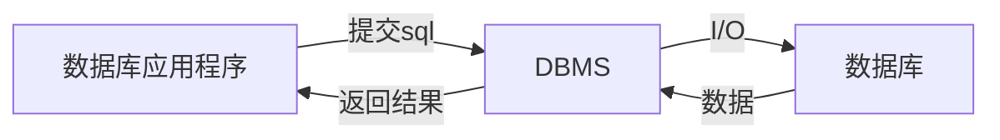

# 1 概论

数据库应用系统类型：业务处理系统、管理信息系统、决策支持系统

数据库系统应用结构：单机用户结构、集中结构、客户/服务器结构、分布式结构

数据库应用系统生命周期：需求分析→系统设计→系统实现→系统测试→系统运行与维护

数据库管理系统

* 按用途分类：通用、专用领域DBMS
* 按用户数分类：单用户、多用户DBMS
* 按系统部署：集中式、分布式DBMS
* 场景：桌面级、企业级DBMS
  * 桌面的数据库应用程序和管理系统常集成在一起；应用程序二号DBMS分开
* 版权：产品、开源DBMS

> 以前概论是出个选择题，DBMS这一小节可能出简答

PostgreSQL

<u>表里面任意两行不能相同</u>

# 2 关系模型

## 2.1 关系

实体：名称、属性

关系：关系表。竖-列/属性，横-行/元组。

* 二维表一行存一个实例，一列存一项属性，单元格存标量，<u>行列均不重复，顺序任意</u>
* <u>一个单元格单个值</u>，一格里多个不行
* 数学定义：R，笛卡尔积

索引不一定唯一

键

* 键：唯一标识元组的属性列→键Key，其他列→非键列。选好一个别的都是非键列，包括能当键的
* 复合键：关系中用多列做标识
* 主键（最好找个开销小的）、候选键（其他满足条件的键）
  * 主键作用：唯一标识、与关联表外键建立联系、组织关系表的数据存储、快速检索
* 代理键：DBMS自动生成，可替代复合主键

> PostgreSQL图形化界面处不能设置复合键

关系语句描述二维表

```sql
RELATION_NAME(Colunm01,Colunm01,...,LastColunm) #关系名(属性,...)
```

有下划线→主键/主键一部分（复合键）

## 2.2 关系模型

<u>数据模型=数据结构+数据操作+数据约束</u>

* 数据操作：集合运算、专门关系操作
* 数据约束：属性列取值类型、范围、是否唯一、是否可空，关联表的参照完整性因素

> 关系用大写字母，标量值用小写

关系模型

* 并运算∪、差运算-、交运算∩、笛卡尔积×

关系R，元祖t，属性列Ri。t行Ai列的值t[Ai]，关系模式R(A1,...,An)，部分列的集合A-属性列/域列，不在A中的列$\overline{A}$，t[A]，连接-做笛卡尔积，像集$Z_x$（在关系X中找到给定值的行，然后取关系Z中把这两行取出来）

* 整个关系不允许重复行，但是取走一些列就可能从产生重复行

关系运算

* 选择/限制：读操作，满足条件的行被留下。只做选择不删数据
* 投影：缩的是列，可能出现重复行记得去掉
* 连接：笛卡尔积中选。筛行不筛列
  * 自然连接∞：要求指向相同对象（比如R.B和S.B要指向对象）
  * 等值连接：和自然连接行数一样，列数不一样

<mark>数据库里所有引号用单引号，不允许出现双引号</mark>

象集Z：$Z_x=\{t[Z]\ |\ t∈R,t[X]=x\}$ 

除法：R(X,Y)、S(Y,Z)中部分列要有相同的属性列（名字可以不同但是逻辑上要相同含义）。R÷S={$t_r[X]\ |\ t_r∈R⋀π_Y(S)⊆Y_X$}：象集/象集的并集包含S关系在Y上投影，这个象集/象集的并集就是一个解，可能多个解也可能没有解

完整性

* 关系完整性
  * 约束作用
* 实体完整性→保证每一行唯一
* 参照完整性→外键必须与现有主键值对应
* 用户自定义完整性

# 3 简单的SQL语句

## 3.1



通常不用VARCHAR（可变长度）做主键，主键要固定长度

SQL语言类型：

```sql
--数据定义语言--
CREATE DATABASE - 创建新数据库
DROP DATABASE – 删除数据库
ALTER DATABASE - 修改数据库属性 
CREATE TABLE - 创建新表 
ALTER TABLE – 修改数据库表结构
DROP TABLE - 删除表
CREATE INDEX - 创建索引
DROP INDEX - 删除索引 
--数据操纵语言--
INSERT - 向数据库表中插入数据 
UPDATE - 更新数据库表中的数据
DELETE - 从数据库表中删除数据 
--数据查询语言--
--数据控制语言--
GRANT – 授予用户对数据库对象的权限
DENY – 拒绝授予用户对数据库对象的权限
REVOKE – 撤消用户对数据库对象的权限
--事务处理语言--
BEGIN TRANSACTION – 开始事务
COMMIT – 提交事务
ROLLBACK – 回滚事务
--游标控制语言--
DECLARE CURSOR – 定义游标
FETCH INTO – 提交游标数据
CLOSE CURSOR– 关闭游标
```

数据类型

```
字符：CHAR、VARCHAR、TEXT
整数：SMALLINT、INTEGER
浮点数：NUMBER(n,d)、FLOAT(n,d)
日期：DATE、DATETIME
货币：MONEY
```

## 3.2 库-增删改查

```sql
create database <数据库名>; --创建数据库
ALTER  DATABASE  <原数据库名>  RENAME TO  <改后数据库名>; --修改数据库名
drop database <数据库名>; --删除数据库
\l --列举所有数据库
\c <数据库名> --选择数据库
```

## 3.3 表-增删改查

完整性约束

```
PRIMARY KEY——主键
NOT NULL——非空值
NULL——空值
UNIQUE——值唯一
CHECK——有效性检查
DEFAULT——缺省值
```

删除创建查询

```sql
DROP TABLE <表名>; --删除表
\l --列举表
\l <表名> --表的详细信息,比如有哪些列
CREATE TABLE <表名> (
	<列名1> <数据类型> [列完整性约束],
	<列名2> <数据类型> [列完整性约束],
    <列名3> <数据类型> [列完整性约束]，
	...
    constraint tablename_PK primary key(某个列名)
);--创建表格式
```

示例：（主键、非空、枚举、缺省值/默认值）

```sql
CREATE TABLE Course(
    CourseID char(4) PRIMARY Key not null, --4位char,主键,不能为空值
    CourseName varchar(20) NOT NULL UNIQUE, --unique取值唯一
    CourseType varchar(10) NULL CHECK(CourseType IN('基础课','专业课','选修课')), --值只能是这三者之一
    CourseCredit smallint NULL, --null可以为空值
    TestMethod char(4) NOT NULL DEFAULT '闭卷考试' --缺省值,就是默认值
);
```

另一种指明主键外键：

```sql
--constraint <约束名> primary key(主键列)
CONSTRAINT CoursePlan_PK PRIMARY Key(CourseID,TeacherID)
CONSTRAINT Department_PK PRIMARY KEY(DepartmentCode) --可以一个也可以复合--
--constraint <约束名>  foreign Key(外键列)
CONSTRAINT CoursePlanID_FK FOREIGN Key(CoursePlanID) REFERENCES Plan(CoursePlanID) --本表的CoursePlanID作为外键与Plan表的CoursePlanID对应
ON DELETE CASCADE --仅外键用,删除本表中数据时关联的表中数据也删除
```

修改表：新增、修改、删除某列

```sql
--ADD修改方式，用于增加新列或列完整性约束--
ALTER TABLE <表名> ADD <新列名称><数据类型>|[完整性约束]
--DROP修改方式，用于删除指定列或列的完整性约束条件--
ALTER TABLE<表名> DROP  COLUMN <列名>；
ALTER TABLE<表名> DROP  CONSTRAINT<完整性约束名>；
--RENAME修改方式，用于修改表名称、列名称--
ALTER TABLE <表名> RENAME TO <新表名>；
ALTER TABLE <表名> RENAME <原列名> TO <新列名>；
--ALTER修改方式，用于修改列的数据类型--
ALTER TABLE <表名> ALTER  COLUMN <列名> TYPE<新的数据类型>；
```

示例：

```sql
ALTER TABLE Student ADD email varchar(20); --新增列
```

## 3.3 索引

```sql
CREATE INDEX <索引名> ON <表名> (<列名>); --新建索引
ALTER INDEX <索引名> RENAME TO <新索引名>; --改名
DROP INDEX <索引名>; --删除
```

## 3.4 数据-增删改

插入数据

```sql
--INSERT INTO TABLE_NAME (column1, column2, column3,...columnN) VALUES (value1, value2, value3,...valueN);
INSERT INTO <表名> VALUES (列值表);
INSERT INTO Student VALUES('2017220101105','柳因','女','1999-04-23','软件工程', 'liuyin@163.com');
--多行插入用逗号隔开
INSERT INTO COMPANY (ID,NAME,AGE,ADDRESS,SALARY,JOIN_DATE) VALUES 
	(4, 'Mark', 25, 'Rich-Mond ', 65000.00, '2007-12-13' ), 
	(5, 'David', 27, 'Texas', 85000.00, '2007-12-13');
```

修改数据

```sql
UPDATE <表名> SET <列名1>=<表达式1>,<列名2>=<表达式2>... WHERE <条件表达式>;
UPDATE Student SET Email='zhaodong@163.com' WHERE StudentName='赵东'
UPDATE COMPANY SET ADDRESS = 'Texas', SALARY=20000; --没有where就全部更改了
```

删除

```sql
DELETE FROM STUDENT WHERE StudentName='张亮';
DELETE FROM COMPANY; --删除整张表
```

## 3.5 表单查询

规范

```sql
SELECT [ALL|DISTINCT] <目标列>[,<目标列>...]
[INTO <新表>]
FROM <表名|视图名>[,<表名|视图名>...]
[WHERE <条件表达式>]
[GROUP BY <列名> [HAVING <条件表达式>]]
[ORDER BY <列名> [ASC | DESC]];
```

查询

```sql
SELECT column1, column2,...columnN FROM table_name;
select * from tablename;
```

有约束的情况

```sql
SELECT * FROM COMPANY WHERE AGE >= 25 AND SALARY >= 6500;
SELECT * FROM COMPANY WHERE SALARY IS NOT NULL;
SELECT * FROM COMPANY WHERE SALARY = 10000;
SELECT * FROM COMPANY WHERE AGE IN ( 25, 27 ); --AGE为25到27的数据
```

表达式

```sql
SELECT numerical_expression as  OPERATION_NAME [FROM table_name WHERE CONDITION] ;
SELECT (17 + 6) AS ADDITION ;
SELECT COUNT(*) AS "RECORDS" FROM COMPANY; --count():返回查询的记录总数
SELECT CURRENT_TIMESTAMP; --日期表达式
```

套娃式子查询

```sql
SELECT * FROM COMPANY WHERE AGE > (SELECT AGE FROM COMPANY WHERE SALARY > 65000);
```

<mark>上面这个语句，多条AGE结果的话，AGE到底大于哪个数</mark>：GPT告诉我以第一条为准，所以建议用order by对子查询结果排序

## 其他 LIKE、LIMIT

<mark>没别的要紧，所以先看别的</mark>

order by：对一列或者多列数据进行升序（ASC）或者降序（DESC）排列

```sql
--SELECT column-list FROM table_name [WHERE condition] [ORDER BY column1, column2, .. columnN] [ASC | DESC];
SELECT * FROM COMPANY ORDER BY AGE ASC; --AGE升序，即由小到大
SELECT * FROM COMPANY ORDER BY NAME, SALARY ASC; --多字段时，会优先按照第一个指定的列进行排序，如果该列存在相同值，则按照第二个指定的列进行排序，以此类推
```

group by：在where之后，order之前。from前面的非聚合的必须在后面出现，聚合的比如SUM（XXX）就不用

```sql
--SELECT column-list FROM table_name WHERE [ conditions ] GROUP BY column1, column2....columnN ORDER BY column1, column2....columnN
SELECT NAME, SUM(SALARY) FROM COMPANY GROUP BY NAME; --按NAMW分组，对NAME一样的对salary求和。不能直接写salary因为要聚合，得有函数聚合起来
```

with：


# 4 E-R模型

E-R模型：实体-联系模型

* 基本元素：实体、属性、标识符（类似主键）、联系
* 联系：
  * 联系里的对应是“最多”，一对一也就是最多是1（可能是0）。'一'是可选，'O'是强制（必须得有一个）
  * 继承：共同属性放在父实体里，各自特有的属性放在子实体里。有互斥性和非互斥性继承，完整和非完整继承

弱实体：对于另外实体有依赖关系的实体，即一个实体的存在必须以另一实体的存在为前提

强实体：被依赖的实体

范式


# 5 


# 示例

## 库

创建数据库

进入数据库

## 表/列

创建表

增删改查表

## 视图


## 触发器


## 用户权限


